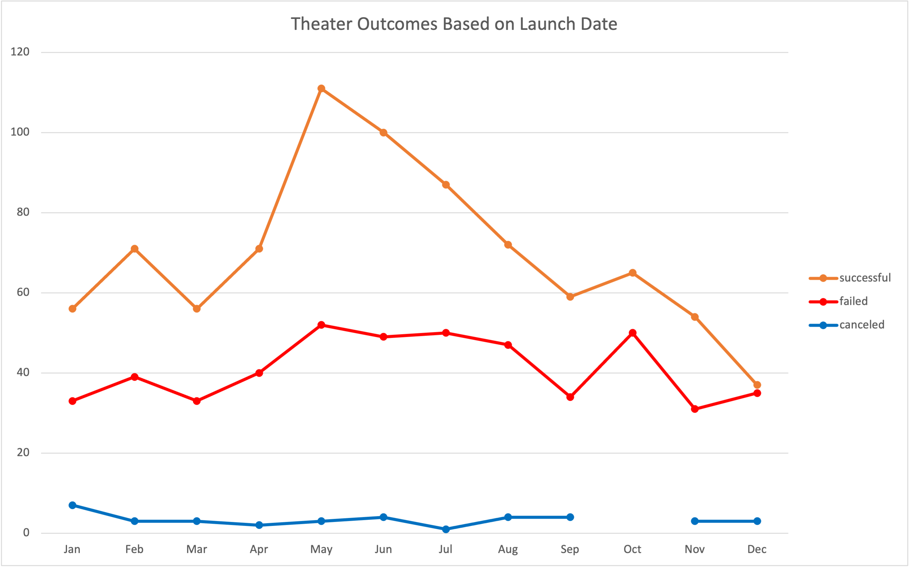
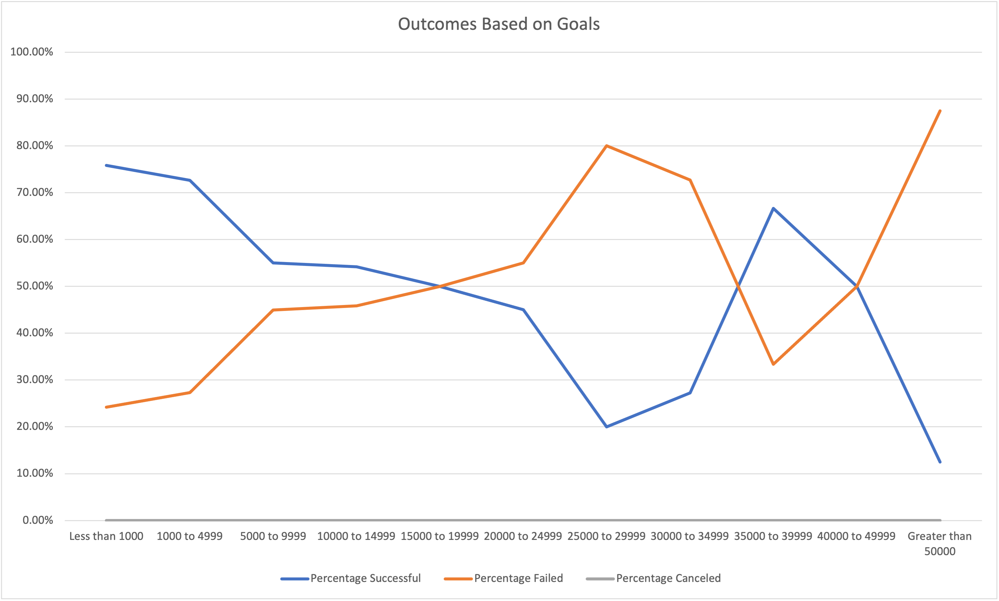

# Crowdfuning Analysis for Louise's play, Fever.
# Overview
### Background
This analysis was done for a playwright named Louise who is starting a crowdfunding campaign for her play – Fever. Louise has estimated a budget for Fever of $10,000. 
### Purpose
Louise has reached out for an analysis to help ease her tension about the budget and to find out if there are any specific factors that contribute to a campaign’s success. Louise’s goal is to have her play mirror a successful crowdfunding campaign as much as possible. 
# Analysis
### Overview
The analysis done for this request was done by extracting data from a crowd funding website that contained data for multiple categories and subcategories. The analysis was completed in two parts: Theater Outcomes by Launch Date and Outcomes based on Goals. 

Theater Outcomes’ analysis was performed by creating a Pivot table, which is an interactive table in Excel which extracts and summarizes data from a dataset. The table created for this analysis is showing the results of the number of successful, cancelled and failed crowdfunding by months for whichever category and year selected by the user viewing the data. For Louise and her play, we have set the table to display all crowdfunding results from 2009 to 2017 for campaigns only in the theater category because we want to provide Louise with as much data that matches her situation. Part of the analysis for this outcome is that we provided Louise with a dynamic graph as well, see figure below. The graph provides a visual representation of the pivot table, separating each outcome by color. With the graph, we and the client are able to visually see in which months each outcome reached its maximum and minimum point. 

The next analysis performed was an analysis on the total number of outcomes based on a range for the campaign’s goal. For this analysis we set out ranges for the goals with each range being $5,000, however the initial range checked is for goals between $0 and $10,000. The reasoning behind choosing a larger initial interval is because the number of campaigns less than ten thousand would have skewed the data significantly causing in outliers in the data that would show an inaccurate analysis.
	
In order to find the total number of outcomes by campaign goal range, we used a COUNT IFS formula that would count the number of times the specific outcome appeared within the designated goal range and was part of the subcategory “plays.” There are three outcomes the analysis accounted for successful, failed, and canceled. Once these counts were collected, we calculated a sum of the total number of campaigns within the range and then the percentage breakdown of each outcome. To calculate the percentage of each outcome, we divided the number of success, failed, and canceled projects by the sum of the number of projects in the range. Using these percentages, a visualization, see figure below, was created that showed each percentage for each range with each type of outcome on a separate line.
  

### Challenges
One challenge that we faced with the crowd funding dataset was the formatting of the data we received. We received the data for the dates in a Unix timestamp, meaning that the dates are given to us in seconds. For us to properly analyze the date fields we had to convert the fields from seconds to a date format that is easier to read, for example in a short date format shown as month-day-year. To convert from seconds to date we divided by the original given to us seconds by 60 (seconds), then divided that by 60 (minutes), then divide that by 24 (hours) to achieve our end total result of a proper month-day-year date.

Another challenge we overcame in our analysis was the combination of a parent category and subcategory present together as one column in the data. For us to achieve an analysis by subcategory or category we had to separate this column into two individual columns in the data: parent category and subcategory. This separation was done by using an Excel feature, “Text to Columns”, that if a pattern is present in a column, then this feature will separate the column by that pattern. In this instance, the pattern in this column was that the category and subcategory were separated by a forward slash making the Category and Subcategory a delimited column with the delimiter being the slash.

# Results
### Theater Outcomes vs Launch Dates
* The rate of success for theater campaigns is highest during the springtime, between the months of March and May, with a steady decline in the summer months, between May and September. This information is beneficial to Louise, because she can now plan her timeline around this. Louise can begin to request money to meet her goal during the springtime where she is most likely to have a successful campaign.
* The higher number of crowdfunding campaigns within a month there are, the greater the number of successes there are within that month. A trend noted by this dataset and visualization is that if the number of campaigns within a month are greater than 100, than the number of successes will be greater than the number of failures and canceled campaigns. This would be helpful for Louise to know during her planning for fundraising, since she now knows that although there are several other campaigns requesting pledges for their goals, Fever’s campaign is more likely to succeed with competition versus if not many other campaigns were crowdfunding.

### Outcomes vs Goals
* As the goals for campaigns increased, the percentage of successful campaigns increased as well. This means that the larger the campaign goal, the more likely the campaign would fail. This is significant because, Louise’s plan for her budget is $10,000 and this visualization very well shows that campaigns within this range have a 75% success rate.

### Summary
Although this dataset provided great insights, there are some limitations to what we were able to accomplish with this data. Some limitations are the data provided, although there are roughly thirteen hundred theater crowdfunding campaigns the best analysis would be with a larger theater crowdfunding dataset with only campaigns that are in the same country where Louise would be hosting her campaign.
This limitation leads the analysis into next steps, in the future we can perform analysis with our current dataset showing visualizations on outcomes by countries. This analysis would provide us with more insight into knowing which countries in the world have a higher success and failure rate. This analysis would help Louise understand the location demographic and where it would be best for her to begin her campaign. 

